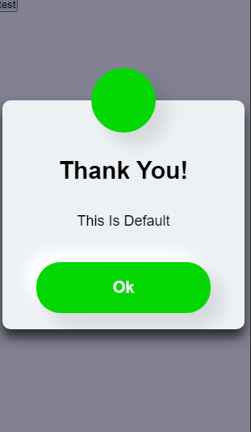
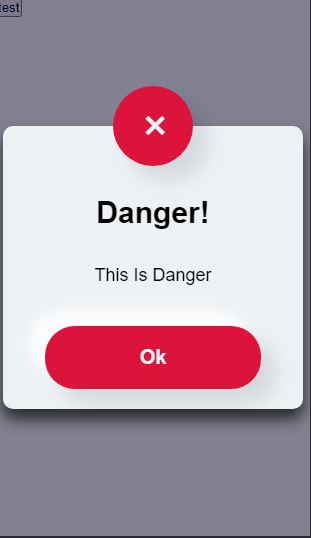
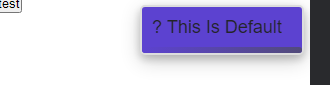

# NonnyAlertJs

NonnyAlertJs is an easy-to-use JavaScript library for alerting users on the frontend. It provides warning alerts, success alerts, and danger alerts based on specific actions. It is especially useful for scenarios such as when a user enters the wrong password, clicks the wrong button, successfully registers, or makes a successful payment.

This library is lightweight, well-tested, and designed to minimize the impact on your application's load time. It accepts several arguments: `time` (in milliseconds) to wait before the alert auto-hides, `position` for positioning the alerts, `textColor` for the alert text color, and `backgroundColor` for the confirmation box's background color.

## Usage
To use NonnyAlertJs, follow these steps:

- Include the `NonnyAlertJs` library in your project using CDN.
```js
<script src="https://coding-nonny.github.io/alert-notify/dist/alertify.js"></script>
```
- Create an instance of `AlertNotify` by providing the appropriate arguments:

```javascript
const message = new AlertNotify(time, position, textColor, backgroundColor);
```

The arguments `time`, `position`, `textColor`, and `backgroundColor` are optional. If not provided, default values will be used.

- Call the `alert_message` method to display an alert message:

```javascript
message.alert_message(messageText, messageType,alertType);
```

The `messageText` parameter represents the text to be displayed in the alert message, and `messageType` (optional) represents the type of alert (e.g., "warning", "success", "danger").

The `alertType` determines the type of alert-box you want to use e.g `Postioned-modal` or `fixed-modal`. Using the `fixed-modal` requires that you include `alert-box.css` from the style folder for proper functionality. Default is `fixed-modal`.

 

`positioned-modal`

- (Optional) Use the shouldAutoHide method to control whether the alert message should auto-hide:


```js
message.shouldAutoHide(autoHide);
```

The `autoHide` parameter is a boolean value (default is `true`). When set to `true`, the alert message will auto-hide. When set to `false`, the alert message will remain visible until the user clicks on it.
- Note   
The `autoHide()` only works when you are using `positioned-modal`.

- (Optional) Use the alert_Confirm method to display a confirmation message:
```js
document.querySelector(".click").onclick =  async () => {
if (await message.alert_Confirm("Do You Think This Is Good?")) {
  message.alert_message("You clicked Yes", "success");
} else {
  message.alert_message("You clicked No", "warning");
}
message.shouldAutoHide(true);
};
```

# Positioning Alerts
NonnyAlertJs provides several positioning options for the alerts. You can use the following values for the `position` argument:
| Position        | Description                   |
| --------------- | ----------------------------- |
| center          | Center of the screen          |
| bottom-center   | Bottom center of the screen   |
| bottom-right    | Bottom right of the screen    |
| bottom-left     | Bottom left of the screen     |
| top-center      | Top center of the screen      |
| top-left        | Top left of the screen        |
| top-right       | Top right of the screen       |

# Using with React
NonnyAlertJs can also be used in React. To use it in a React component, follow these steps:

1. Install the NonnyAlertJs package using a package manager like npm:
```bash
npm install nonnyalertjs
```
2. Import the necessary dependencies:

```js
import React from 'react';
import AlertNotify from 'nonnyalertjs';
import 'nonnyalertjs/style/alert-box.css'; // Import the CSS file
```
3. Create an instance of AlertNotify and use it in your React component:
```jsx
const MyComponent = () => {
const message = new AlertNotify(time, position, textColor, backgroundColor);

const handleConfirmation = async () => {

if (await message.alert_Confirm("Do You Think This Is Good?")) {
  message.alert_message("You clicked Yes", "success");
} else {
  message.alert_message("You clicked No", "warning");
}
message.shouldAutoHide(true);
};

return (
<div>
<button onClick={handleConfirmation}>Click Me</button>
</div>
);
};

export default MyComponent;
```
or use my already made component `notify.jsx` located in component folder


Make sure to import the CSS file provided by NonnyAlertJs to ensure the styles are applied correctly.

With these steps, you can now use NonnyAlertJs in your React components and take advantage of its alerting and confirmation features.

Note: 

Remember to replace `time`, `position`, `textColor`, and `backgroundColor` with the desired values when creating the `AlertNotify` instance.

[click here for live example](https://coding-nonny.github.io/alert-notify/test.html)
